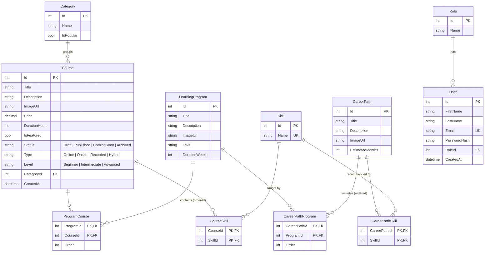

# Andalusia Academy — Backend API

ASP.NET Core (.NET 10) Web API for the Andalusia Academy learning platform.
It serves the homepage CMS content and the academy catalog: **Courses, Programs and Career Paths**.

## Tech stack

- ASP.NET Core Web API (.NET 10)
- Entity Framework Core 10 + SQL Server (LocalDB in development)
- OpenAPI + Swagger UI

## Getting started

1. Install the [.NET 10 SDK](https://dotnet.microsoft.com/download) and the EF Core tool:
   ```bash
   dotnet tool install --global dotnet-ef
   ```
2. Check the connection string `ConnectionStrings:Default` in `appsettings.json`
   (by default it uses `(localdb)\MSSQLLocalDB`, database `Andalusia_learning_platform`).
3. Create the database and load the seed data:
   ```bash
   dotnet ef database update
   ```
4. Run the API:
   ```bash
   dotnet run --launch-profile http
   ```
5. Open Swagger at **http://localhost:5043/swagger** (or https://localhost:7169/swagger with the `https` profile).

The React frontend (`http://localhost:5173`) is allowed by the `ReactDev` CORS policy.

## Project structure

```
Controllers/   API endpoints (thin, call services)
Services/      Business logic and DTO building
Repo/          Data access with EF Core (one repo per module)
Model/         EF Core entities and enums
DTOs/          Response models returned by the API
Mapping/       Entity -> DTO mapping helpers
Pagination/    Paging/filter parameters and the PageResult<T> wrapper
Data/          ApplicationDbContext and seed data
Middleware/    Global exception handling (ProblemDetails responses)
Exceptions/    Custom exceptions (NotFound -> 404, AlreadyExist -> 400)
Migrations/    EF Core migrations
```

## API endpoints

| Method | Route | Description |
|---|---|---|
| GET | `/api/Homepage` | Hero, corporate section, featured courses, popular categories, partners, testimonials |
| GET | `/api/PublicCatalog/courses` | All public courses |
| GET | `/api/PublicCatalog/courses/search` | Search, filter, sort and paginate courses |
| GET | `/api/PublicCatalog/courses/{id}` | Course details with skills, programs that include it and related courses |
| GET | `/api/PublicCatalog/categories` | Categories with course counts |
| GET | `/api/Programs` | All programs |
| GET | `/api/Programs/{id}` | Program details: ordered courses, total hours, skills, career paths, related programs |
| GET | `/api/CareerPaths` | All career paths |
| GET | `/api/CareerPaths/{id}` | Career path details: skills, programs and recommended courses |

Unknown ids return `404` with a ProblemDetails body.

### Course search parameters

All parameters are optional query string values.

| Parameter | Example | Notes |
|---|---|---|
| `search` | `react` | Matches the title or description |
| `categoryId` | `1` | |
| `skillId` | `3` | Courses that teach this skill |
| `status` | `Published` | `Published`, `ComingSoon` |
| `type` | `Online` | `Online`, `Onsite`, `Recorded`, `Hybrid` |
| `level` | `Beginner` | `Beginner`, `Intermediate`, `Advanced` |
| `minPrice` / `maxPrice` | `0` / `100` | |
| `sortBy` | `price` | `title`, `price`, `duration`, `createdAt` (default: id) |
| `order` | `desc` | `asc` (default) or `desc` |
| `page` | `1` | Default 1 |
| `pageSize` | `10` | Default 20, max 100 |

Example:

```
GET /api/PublicCatalog/courses/search?search=data&level=Intermediate&sortBy=price&order=desc&page=1&pageSize=10
```

Response:

```json
{
  "data": [ { "id": 11, "title": "Data Analysis with Pandas", "status": "Published", "type": "Online", "level": "Intermediate", "...": "..." } ],
  "page": 1,
  "pageSize": 10,
  "totalCount": 2,
  "totalPages": 1,
  "hasNextPage": false,
  "hasPreviousPage": false
}
```

### Course status rules

| Status | Shown in the public catalog |
|---|---|
| `Published` | Yes |
| `ComingSoon` | Yes (can be listed, not yet open for enrollment) |
| `Draft` | No |
| `Archived` | No |

Enums are sent and received as strings in JSON (`"Published"`, not `1`).

## Data model (ERD v2)

A **Career Path** is made of ordered **Programs**, a **Program** is made of ordered **Courses**,
and **Skills** link courses to career paths. A course can belong to many programs, and a program
can belong to many career paths.



The `LearningProgram` entity is stored in the `Programs` table. CMS tables (`HomepageContents`, `Partners`,
`Testimonials`) are standalone and have no relationships.

### How recommendations work

- **Related courses** (course details): public courses in the same category or sharing skills, ranked by the number of shared skills.
- **Related programs** (program details): programs that share a career path or a course.
- **Recommended courses** (career path details): the courses of the path's programs in order, followed by other courses that teach the path's skills.

## Seed data

The `Sprint2_CatalogAndDiscovery` migration loads demo data from `Data/SeedData.cs`:

| Table | Rows |
|---|---|
| Categories | 6 |
| Skills | 16 |
| Courses | 25 (including 2 `ComingSoon` and 1 `Draft`) |
| Programs | 7 |
| Career Paths | 6 (*Cybersecurity Analyst* has no programs and gets its recommendations from skills only) |
| Partners | 5 |
| Testimonials | 4 |
| Roles | Admin, Instructor, Learner, Content Manager |

> **Note:** this migration deletes any existing rows in `Courses`, `Programs`, `CareerPaths`, `Categories`,
> `Partners` and `Testimonials` before inserting the seed data. Users, roles and homepage content are not touched.
